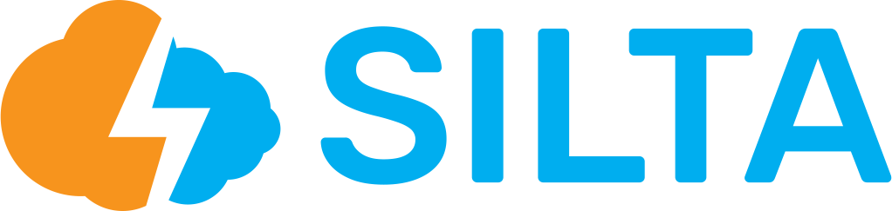
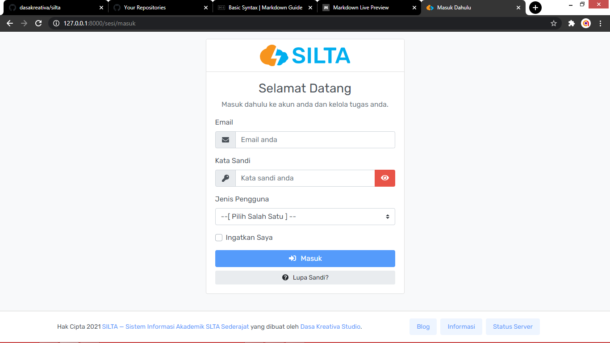

# SILTA
### Sistem Informasi Akademik Tingkat SLTA Sederajat
 

SILTA ini merupakan singkatan dari **Sistem Informasi Akademik Tingkat SLTA Sederajat** yang mana aplikasi untuk mengelola tata usaha sekolahan dan juga kegiatan belajar mengajar siswa secara online atau daring layaknya google classroom.

Aplikasi ini diinisialisasi oleh **Dasa Kreativa Studio** dengan harapan supaya aplikasi ini bisa diterapkan pada sekolah masing-masing tanpa ketergantungan terhadap Google Classroom.

| Pengembang     | Dasa Kreativa Studio         |
| -------------- | ---------------------------- |
| Versi          | 1.0.0 (Beta Maret 2021)      |
| Tanggal Revisi | 29 Maret 2021                |
| Status         | Beta Release Candidate       |
